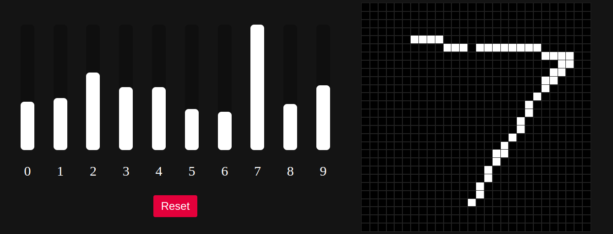

# MNIST Classifier

A python flask web server that provides real-time classification of hand-drawn digits.

## Install/Download

Clone this repo and change directory into it

```bash
git clone https://github.com/mdhvg/MNIST-classifier
cd MNIST-classifier
```

Create a python virtual environment (optional)

```bash
python -m venv .env
source .env/bin/activate
```

Install dependencies

```bash
pip install -r requirements.txt
```

## Usage

Run the flask server

```bash
python main.py
```

Open the webpage on `127.0.0.1:5000` and Draw!

